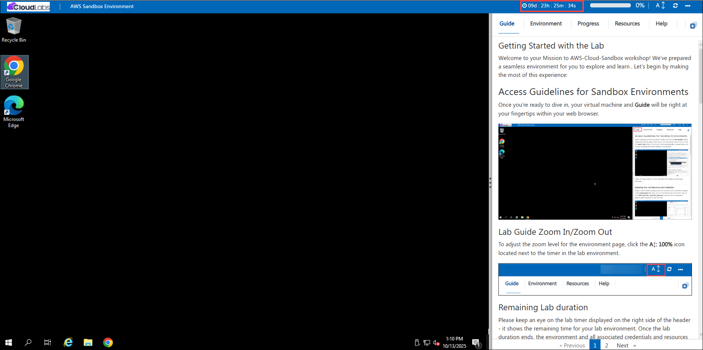
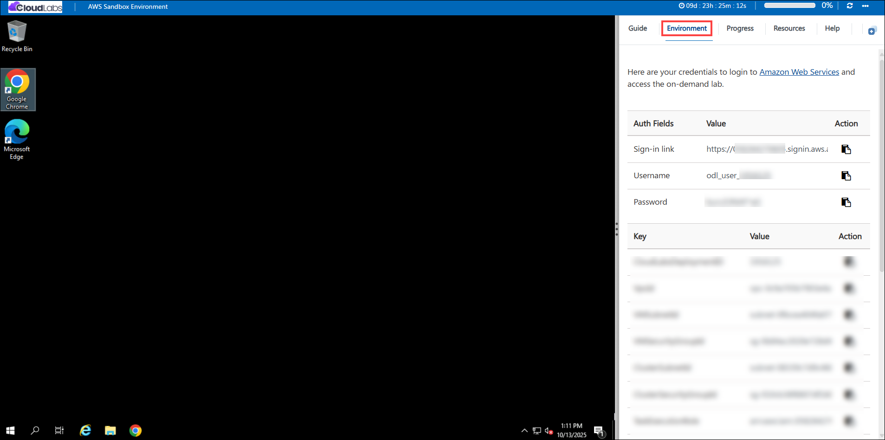
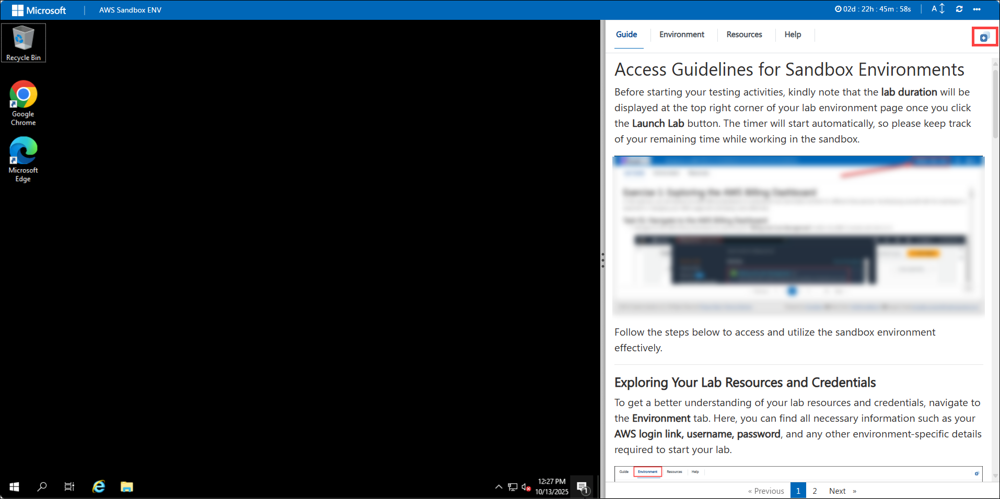
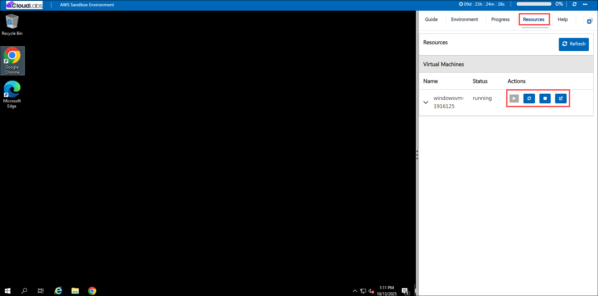

# Access Guidelines for Sandbox Environments

Before starting your testing activities, kindly note that the **lab duration** will be displayed at the top right corner of your lab environment page once you click the **Launch Lab** button. The timer will start automatically, so please keep track of your remaining time while working in the sandbox.

Follow the steps below to access and utilize the sandbox environment effectively.

---

### **Exploring Your Lab Resources and Credentials**

To get a better understanding of your lab resources and credentials, navigate to the **Environment** tab.
Here, you can find all necessary information such as your **AWS login link, username, password**, and any other environment-specific details required to start your lab.

   
   
---

### **Utilizing the Split Window Feature**

For convenience, you can open the lab guide in a separate window by selecting the **Split Window** button located at the **top-right corner** of your screen.

**Note:**
Some options may not be visible depending on your current screen resolution. In such cases, use the **Split Window** feature to open the lab guide in a separate tab or window and maximize the view of your virtual machine.
You can enable this by clicking the **“+” (plus)** button in the top-right corner of the lab interface.

   
 
---

### **Managing Your Virtual Machine**

You have full control over your virtual machine (VM) during the lab.
From the **Resources** tab, you can **start**, **stop**, or **restart** your VM as needed to suit your testing and learning workflow.

   
 
Your experience is entirely in your hands—manage your resources wisely to make the most of your lab time.

---

### 1. Sign In to the CloudLabs AWS Environment

1. Sign in to the AWS Management Console by copying the **Sign-in link, Username, and Password** provided below.

    * **Sign-in Link**: **<inject key="SignInUrl" enableCopy="true" />**

    * **IAM Username**: **<inject key="UserName" enableCopy="true" />**

    * **Password**: **<inject key="Password" enableCopy="true" />**

   

   Alternatively, you can access the same details from the **CloudLabs** interface as shown below.

   

---

### 2. Select the Correct Region

After signing in, choose the region **US-EAST-1 (N. Virginia)** from the region selector at the top-right corner of the AWS Management Console.

> **Note:**
> The sandbox environment is configured primarily for the **US-EAST-1 (N. Virginia)** region.
> Some services may not be available or may fail to deploy in other regions, so always ensure you are operating within **US-EAST-1** unless explicitly instructed otherwise
