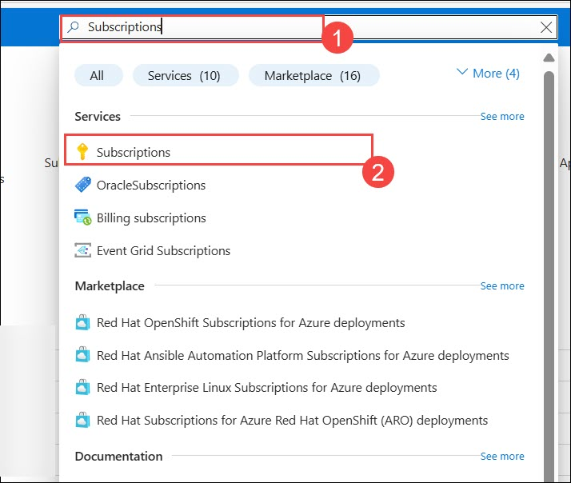
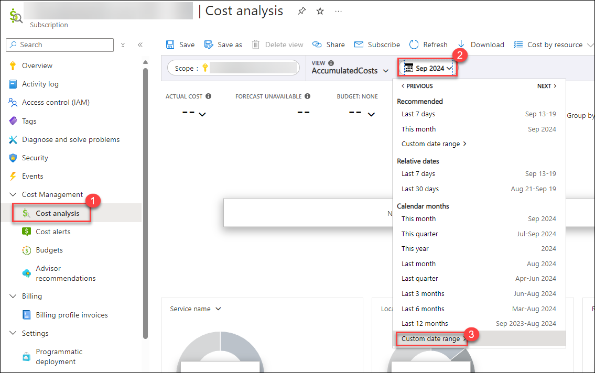
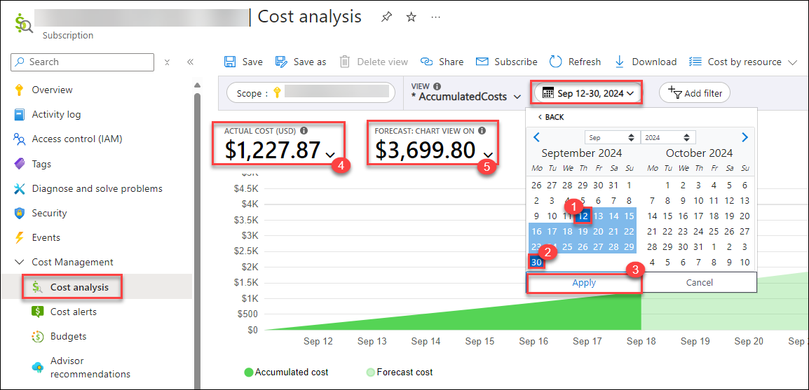

# Azure Cloud Sandbox

## About the Sandbox Environment

| Resources | Value | Remarks |
| --- | --- | --- |
| **Enabled Services** | `Azure Storage Account (Blob Storage)`   `Azure SQL Database`   `Virtual Machine (VM)`   `Identity and Access Management (IAM)`   `Virtual Network (VNet)`   `App Service`   `Azure Monitor`   `Key Vault`   `Azure Functions` | You will have read-level access to the Azure subscription, allowing you to explore and review the available Azure resources mentioned above. |
| **Azure Entra ID User** | Pre-created Entra ID user account | You will receive one Entra ID user account for authentication and access management. |
| **Azure Subscription Permissions** | Reader role privilege over Azure Subscription | You will get Reader role access on the Azure Subscription. |
| **Azure Credit** | 20 USD | A consumption limit of 20 USD is applied to manage Azure spending. |
| **Credit Alerts** | Credit Alerts are set on consumption of 50%, 75%, 90%, 95%, and 100% of total Azure credits. | Check your registered email inbox for credit alert notifications to manage your Azure usage effectively. |
| **Sandbox Duration** | 10 Days / 240 Hours or until Azure Consumption Credits are exhausted | The sandbox environment will be automatically deleted after 30 days or when credits are fully utilized, whichever occurs first. |

## Notes:
* The Azure credit consumption includes all the resources which you will be deploying while using the sandbox environment for your use case. 
* You will have **Reader** privilege access on Azure Subscription, you can freely explore the features of required services and are recommended to use it only for learning purposes. 
* As each sandbox environment has a fixed budget/cap of $20 USD, Sandbox as they can consume the Azure credit leading to the automatic deallocation of the Sandbox as soon as the credit limit is reached.  

## Cost Monitoring:
To monitor and analyse your Azure credit spend, you can navigate to the Azure Subscription page by following the steps mentioned below.
+ From the Azure portal home page, search for **Subscriptions (1)** using the search bar and select the same from the suggestions.
  
  
  
+ Select the Cost Analysis tab from the Cost Management pane. You can access a comprehensive breakdown of your Azure spending, offering a granular view of costs associated with various services, and resources. To get the accurate consumed cost by you, select the **Calendar (2)** from **Cost analysis (1)**  then **Custom date Range (3)**.

   

+ Now, select the custom dates.
    + **Start Date: (1)** The date when you redeemed voucher and launch the Sandbox environment.
    + **End Date: (2)** Current or future date. If you select the future date, you can also get the forecasted cost based on the current resources you deployed.
    + You can see the **ACTUAL COST (USD) (4)** and the **FORECAST: CHART VIEW ON (5)** cost.

   

## Best Practices:
+ **Resources usage:** Please stop the virtual machines, WebApps, Azure Kubernetes service, Azure Container Instance and other resources when not in use to minimize the Azure spend.
+ **Azure Cost Analysis:** Maintain a practice of regularly checking the Cost Analysis report for the assigned Azure subscription to ensure the sustainability of the environment over an extended period.
+ **Alert notifications:** Make sure to check your registered email's inbox for any alert-related emails. Alerts give you can head start to keep your Azure spending in control and to plan out the remaining credits in the best way possible.

## Common Troubleshooting

Here are few common issues and fix which you might encounter while performing the lab.

- VM Remote connection issue: RDP: [Known Functionality Issues | CloudLabs Documentation](https://docs.cloudlabs.ai/Learner/Troubleshooting/RDP/)

- Copy Paste Issue: [Copy Paste | CloudLabs Documentation](https://docs.cloudlabs.ai/Learner/Troubleshooting/CopyPaste/)

## CloudLabs Support Contacts:
You can reach out to the support team in case you face any difficulty in using the sandbox environment, any permission, or Azure consumption-related queries.

* Sandbox user Email Support:  cloudlabs-support@spektrasystems.com
* Sandbox user Live Chat Support: https://cloudlabs.ai/ms-support

