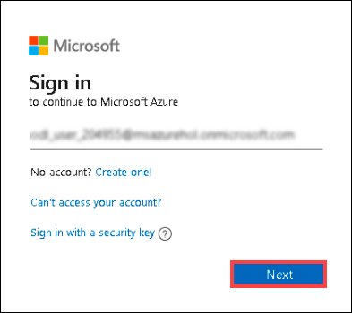
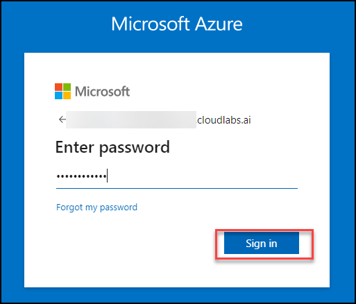

# Getting Started with the Lab

1. From the lab guide page, you can view instructions on which resources can be used and deployed, as well as the Azure usage limits.

1. To get the lab environment details, you can select the **Environment Details** tab. Additionally, the credentials will also be emailed to your registered email address. 

    

1. Click "Next" from the bottom right corner to embark on your Lab journey!

## Login to Azure Portal

1. Please open a browser on your laptop, preferably an InPrivate/Incognito window and navigate to [Azure Portal](https://portal.azure.com).
   
1. On **Sign into Microsoft Azure** tab you will see the login screen, in that enter the following email/username and then click on **Next**. 

   * Email/Username: <inject key="AzureAdUserEmail"></inject>
   
     

     > **Note:** If you get a **Download Microsoft Edge mobile app** popup, then click on **Do not show** dropdown and select **Don't show this recommendation again**. 
     
1. Now enter the following password and click on **Sign in**.

   * Password: <inject key="AzureAdUserPassword"></inject>
   
     
  
1. If you see the pop-up **Stay Signed in?**, click No

1. If you see the pop-up **You have free Azure Advisor recommendations!**, close the window to continue the lab.

1. If a **Welcome to Microsoft Azure** popup window appears, click **Maybe Later** to skip the tour.

### Now, you are all set to start!

## Happy Learning!!
